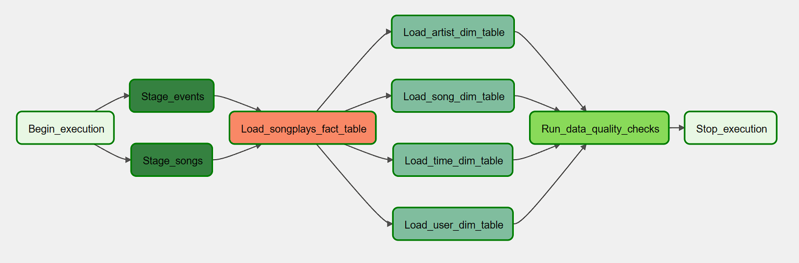
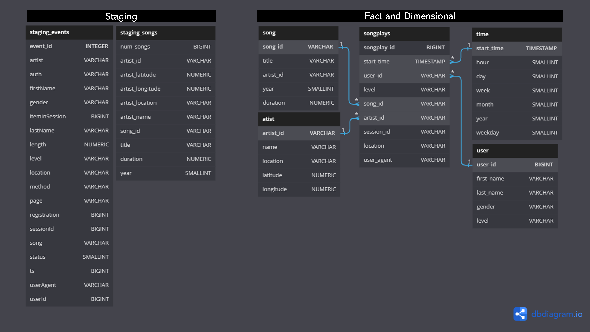
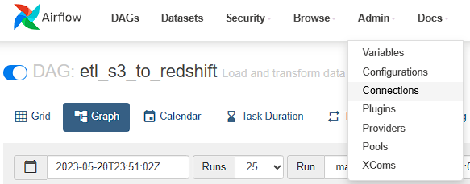
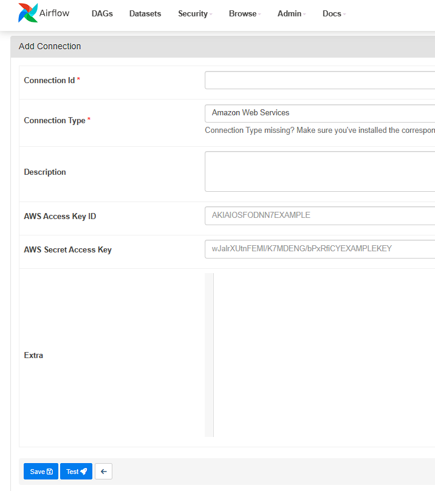
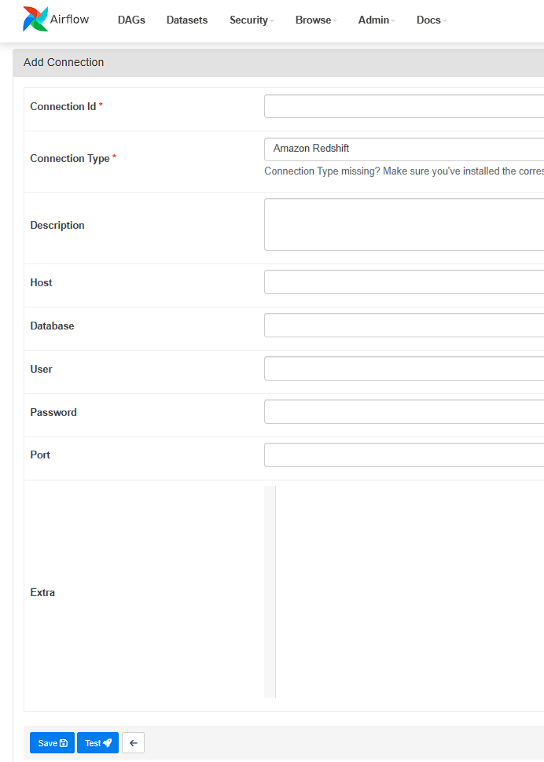

# Udacity Data Engineering Nanodegree Project: Data Pipelines with Airflow

## Introduction

A music streaming company, Sparkify, has decided that it is time to introduce more automation and monitoring to their data warehouse ETL pipelines and come to the conclusion that the best tool to achieve this is Apache Airflow.

The source data resides in S3 and needs to be processed in Sparkify's data warehouse in Amazon Redshift. The source datasets consist of JSON logs that tell about user activity in the application and JSON metadata about the songs the users listen to.



___
### Data Source

Sparkify's data was stored in two buckets in AWS S3.

#### **songs**
- bucket: `s3://udacity-dend/song_data`
- description: metadata about a song and the artist of that song.
- schema: {"num_songs": 1, "artist_id": "ARJIE2Y1187B994AB7", "artist_latitude": null, "artist_longitude": null, "artist_location": "", "artist_name": "Line Renaud", "song_id": "SOUPIRU12A6D4FA1E1", "title": "Der Kleine Dompfaff", "duration": 152.92036, "year": 0}

#### **events (log)**
- bucket: `s3://udacity-dend/log_data`
- description: app activity logs.
- schema: stored in a json file (located in `s3://udacity-dend/log_json_path.json`) of meta information that is required by AWS to correctly load the log data.

___
### Data warehouse

The source data (songs and logs) will be copied into two staging tables, from which the analytics tables (1 fact table and 4 dimensional tables) in a star schema will be built.



___
#### **Staging tables**

##### **staging_events**
This table is built by copying the data from `s3://udacity-dend/log_data`. 

##### **staging_songs**
This table is built by copying the data from `s3://udacity-dend/song_data`. 

___
#### **Analytics tables**

#### Fact tables

##### **songplays**
- description: records in event data associated with song plays i.e. records with page
- cols: songplay_id, start_time, user_id, level, song_id, artist_id, session_id, location, user_agent

#### Dimension tables

##### **users**
- description: users in the app
- cols: user_id, first_name, last_name, gender, level

##### **songs**
- description: songs in music database
- cols: song_id, title, artist_id, year, duration

##### **artists**
- description: artists in music database
- cols: artist_id, name, location, lattitude, longitude

##### **time**
- description: timestamps of records in songplays broken down into specific units
- cols: start_time, hour, day, week, month, year, weekday

___
## How to run

1. Requirements:
    * Install [Python3](https://www.python.org/downloads/).
    * Install [Docker](https://www.docker.com/).
    * Install [Docker Compose](https://docs.docker.com/compose/install/).
    * Create an [AWS](https://aws.amazon.com/) account.
    * Create a [Redshift](https://aws.amazon.com/redshift/) cluster.

2. Clone repository to local machine

    ```
    git clone https://github.com/jvmlima/udacity-dend-project-airflow.git
    ```

3. Change directory to local repository

    ```
    cd udacity-dend-project-airflow
    ```

4. Create a python virtual environment (optional)

    ```
    python3 -m venv .venv             # create virtualenv
    .venv/Script/activate             # activate virtualenv
    pip install -r requirements.txt   # install requirements
    ```

5. Start the Airflow container

    To run Airflow in Docker, we need to start the container configured in the [docker-compose.yml](https://airflow.apache.org/docs/apache-airflow/stable/howto/docker-compose/index.html).
    ```
    docker-compose up
    ```
___
## **The Airflow UI**

The airflow UI can be accessed in http://localhost:8080. 

- Username: airflow 
- Password: airflow

### **Connect Airflow to AWS**

First, we need to pass to airflow the aws credentials and the redshift connection data.

#### **AWS Credentials**

1. Click on the Admin tab and select Connections.


2. Under Connections, select Create.

3. On the create connection page, enter the following values:

    - Connection Id: *aws_credentials*.
    - Connection Type: *Amazon Web Services*.
    - AWS Access Key ID: *Access key ID* from the IAM User credentials.
    - AWS Secret Access Key: *Secret access key* from the IAM User credentials.


Once you've entered these values, select Save and Add Another.

#### **Redshift**
1. On the create connection page, enter the following values:
    - Connection Id: *redshift*.
    - Connection Type: *Amazon Redshift*.
    - Host: *Redshift cluster endpoint*.
    - Database: *dev*.
    - User: *awsuser*.
    - Password: Enter the password you created when launching your Redshift cluster.
    - Port: *5439*.


Once you've entered these values, select Save.

___
### **Run the DAG**
Click on the **etl_s3_to_redshift** and then trigger the dag by clicking on the play button.

The whole pipeline should take less than 5 minutes to complete.
